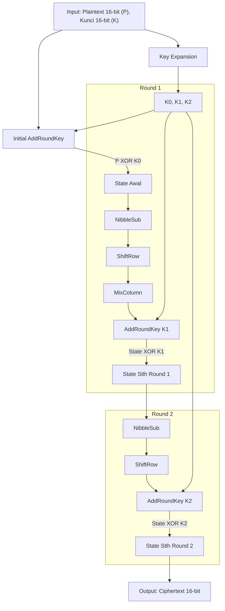
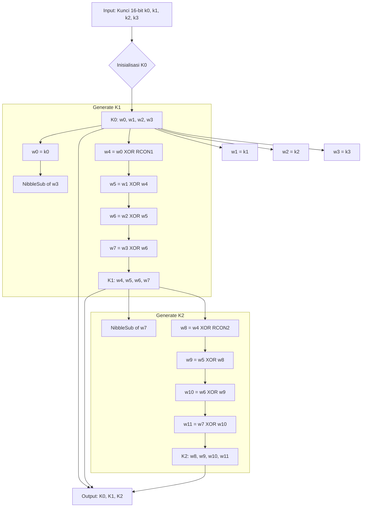
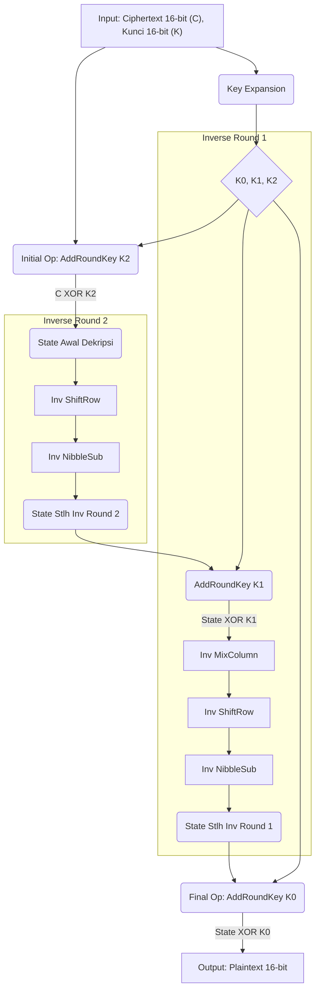

## Anggota Kelompok

- Muhammad Faqih Husain - 5027231023
- Kevin Anugerah Faza - 5027231027
- Athalla Barka Fadhil - 5027231018
- Muhammad Dzaky Ahnaf - 5027231039
- Harwinda - 5027231079

## Onboarding

1. pastikan `uv` sudah terinstall https://docs.astral.sh/uv/getting-started/installation/
2. `uv python install 3.10`
3. `uv venv` (pastikan menggunakan python >=3.10 )
4. `source .venv/bin/activate`
5. `uv run main.py`

## How to run

### Enkripsi teks dengan ECB (verbose mode)

`uv run main.py encrypt "Hello" A73B -v`

### Dekripsi file dengan CBC

`uv run main.py decrypt cipher.bin A73B -m CBC -f -o plain.txt`

### Enkripsi hex dengan CBC

`uv run main.py encrypt 9C63 C3F0 -m CBC`

### Uji Avalanche Effect

`uv run main.py encrypt 9C63 C3F0 --avalanche`

### Contoh

`uv run main.py encrypt plain.txt A73B -m CBC -f -o cipher.bin`
`uv run main.py decrypt cipher.bin A73B -m CBC -f -o decrypted.txt`

## Analisis Keamanan Sensitivitas dan Avalanche Effect

- Uji sensitivitas terhadap perubahan 1-bit di plaintext atau key:

Kode ini diimplementasikan dalam fungsi `test_avalanche_effect` di file `main.py`. Fungsi ini secara acak memilih satu bit pada plaintext atau kunci, membaliknya (`XOR` dengan bitmask), mengenkripsi ulang data dengan input yang telah dimodifikasi tersebut, dan membandingkan hasilnya dengan ciphertext original menggunakan Hamming Distance.

- Avalanche Effect

Pada Avalanche, Perubahan kecil pada input (misalnya, mengubah hanya *satu bit* pada plaintext atau kunci) harus menyebabkan perubahan yang signifikan dan tampak acak pada output (ciphertext).

Pengaplikasiannya disini adalah dengan mengukur efek avalanche menggunakan penghitungan **jumlah bit yang berbeda** (menggunakan Hamming Distance) antara ciphertext asli dan ciphertext yang dihasilkan setelah perubahan 1-bit pada input.

Idealnya, perubahan 1-bit input akan menyebabkan sekitar 50% bit pada ciphertext berubah (misalnya, ~8 bit untuk blok 16-bit pada Mini-AES ini). Semakin dekat ke 50%, semakin baik efek avalanche-nya, yang menunjukkan difusi perubahan yang baik di seluruh ciphertext dan menyulitkan analisis kriptografi.

## Dokumentasi & Analisis Mini-AES

Dokumentasi ini mencakup flowchart algoritma, spesifikasi, penjelasan test case, dan analisis kelebihan/keterbatasan Mini-AES berdasarkan paper oleh Raphael Chung-Wei Phan dan implementasi Python di repository ini.

---

## 1. Flowchart Algoritma

Berikut adalah diagram flowchart yang menggambarkan proses utama dalam Mini-AES.

### a. Flowchart Enkripsi Mini-AES (2 Rounds)

### b. Flowchart Key Expansion Mini-AES

### c. Flowchart Dekripsi Mini-AES

## 2. Spesifikasi Mini-AES

Berdasarkan paper oleh Raphael Chung-Wei Phan dan implementasi Python:

- **Nama Algoritma**: Mini Advanced Encryption Standard (Mini-AES).
- **Jenis**: Block Cipher Simetris.
- **Ukuran Blok**: 16 bit (direpresentasikan sebagai matriks 2x2 nibble).
- **Ukuran Kunci**: 16 bit.
- **Jumlah Round**: 2 round standar (Paper juga membahas ekstensi ke 4 round untuk analisis serangan Square).
- **Struktur Round**: Terdiri dari operasi NibbleSub, ShiftRow, MixColumn, dan AddRoundKey. Round terakhir tidak menggunakan MixColumn. Terdapat AddRoundKey tambahan sebelum round pertama.

**Komponen**:
- **NibbleSub**: Substitusi non-linear per nibble menggunakan S-Box (diambil dari S-Box DES baris pertama).
- **ShiftRow**: Pergeseran rotasi kiri 1 nibble pada baris kedua matriks state. Baris pertama tidak berubah.
- **MixColumn**: Operasi pencampuran linier per kolom menggunakan perkalian matriks konstan [[3, 2], [2, 3]] dalam GF(2⁴). Operasi ini adalah inversenya sendiri.
- **AddRoundKey**: Operasi XOR antara state dengan round key.
- **Key Expansion**: Algoritma untuk menghasilkan 3 round key (K0, K1, K2) dari kunci utama 16-bit, melibatkan operasi NibbleSub, XOR, dan konstanta round (RCON).
- **Field Matematika**: Operasi MixColumn dan Key Expansion menggunakan aritmatika dalam Galois Field GF(2⁴) dengan polinomial nereduksi x⁴+x+1.
- **Tujuan**: Edukasi dan testbed untuk mempelajari AES dan kriptanalisis. Bukan untuk aplikasi keamanan nyata.

## 3. Penjelasan Test Case

Kita akan menggunakan contoh yang ada di akhir file encrypt_decrypt.py:

**Plaintext (Hex)**: 9C63  
**Kunci (Hex)**: C3F0

**Langkah-langkah Enkripsi** (sesuai output verbose encrypt_decrypt.py):

**Input Awal**:
- Plaintext State: [9, 12, 6, 3] (dari 9C63)
- Key State: [12, 3, 15, 0] (dari C3F0)

**Key Expansion**:
- K0: [12, 3, 15, 0] (C3F0)
- K1: [3, 0, 15, 15] (30FF)
- K2: [6, 6, 9, 6] (6696)

**Initial AddRoundKey (Pre-Round)**:
- State = [9, 12, 6, 3] XOR [12, 3, 15, 0] = [5, 15, 9, 3] (5F93)

**Round 1**:
- NibbleSub: [S(5), S(15), S(9), S(3)] = [15, 7, 10, 1] (F7A1)
- ShiftRow: [15, 1, 10, 7] (F1A7) (Nibble ke-2 dan ke-4 ditukar)
- MixColumn: State menjadi [0, 14, 3, 14] (0E3E) (Berdasarkan output kode)
- AddRoundKey (K1): [0, 14, 3, 14] XOR [3, 0, 15, 15] = [3, 14, 12, 1] (3EC1)

**Round 2 (Final Round)**:
- NibbleSub: [S(3), S(14), S(12), S(1)] = [1, 0, 5, 4] (1054)
- ShiftRow: [1, 4, 5, 0] (1450) (Nibble ke-2 dan ke-4 ditukar)
- (MixColumn dilewati)
- AddRoundKey (K2): [1, 4, 5, 0] XOR [6, 6, 9, 6] = [7, 2, 12, 6] (72C6)

**Output Ciphertext**: 72C6

**Verifikasi Dekripsi**: Kode encrypt_decrypt.py juga menunjukkan proses dekripsi yang berhasil mengembalikan 72C6 menjadi 9C63 menggunakan kunci yang sama, memvalidasi implementasi operasi invers.

## 4. Analisis Kelebihan dan Keterbatasan

### Kelebihan Mini-AES:

1. **Edukasi**: Sangat baik untuk tujuan pembelajaran. Menyederhanakan konsep kompleks AES (seperti operasi di Galois Field, struktur round, key expansion) ke ukuran yang lebih mudah dikelola. Mahasiswa dapat menelusuri enkripsi/dekripsi secara manual.

2. **Struktur Mirip AES**: Mempertahankan struktur dasar Rijndael (AES), memudahkan transisi pemahaman ke AES sebenarnya. Komponen seperti SubBytes (NibbleSub), ShiftRows, MixColumns, AddRoundKey memiliki padanan langsung.

3. **Testbed Kriptanalisis**: Ukurannya yang kecil memungkinkan mahasiswa untuk mencoba menerapkan teknik kriptanalisis dasar (seperti serangan Square yang didemonstrasikan dalam paper) tanpa membutuhkan sumber daya komputasi besar.

4. **Implementasi Sederhana**: Relatif mudah diimplementasikan dalam kode dibandingkan AES penuh, memungkinkan fokus pada pemahaman algoritma inti.

### Keterbatasan Mini-AES:

1. **Tidak Aman**: Sama sekali tidak aman untuk penggunaan praktis. Ukuran blok (16-bit) dan kunci (16-bit) sangat kecil, membuatnya rentan terhadap serangan brute-force dalam hitungan detik atau kurang pada komputer modern.

2. **Jumlah Round Sedikit**: Hanya 2 round standar, jauh lebih sedikit dari AES (minimal 10 round). Ini berarti difusi dan kebingungan (diffusion & confusion) yang dicapai sangat terbatas, memudahkan analisis statistik dan serangan lainnya.

3. **S-Box Sederhana**: Menggunakan S-Box yang sangat kecil (4x4) dan diambil dari DES, bukan S-Box AES yang didesain dengan kriteria keamanan lebih ketat.

4. **Key Schedule Simpel**: Key schedule-nya jauh lebih sederhana daripada AES, mungkin memiliki kelemahan yang tidak ada di AES asli.

5. **Analisis Terbatas**: Meskipun bagus untuk belajar serangan dasar seperti Square, ketahanan terhadap serangan diferensial, linier, atau serangan terkait kunci yang lebih canggih sangat rendah dan tidak representatif untuk AES penuh.

6. **Kurangnya Fitur Lanjutan**: Implementasi dasar mungkin tidak mencakup mode operasi yang aman (selain ECB). Dalam praktiknya, AES hampir selalu digunakan dengan mode operasi seperti CBC, CTR, atau GCM untuk keamanan yang lebih baik.

7. **Tidak ada Fungsi Padding**: Tidak ada mekanisme padding standar untuk menangani plaintext yang panjangnya bukan kelipatan ukuran blok, yang merupakan komponen penting dalam implementasi praktis.

8. **Kurangnya Standar Interoperabilitas**: Tidak ada standar industri untuk implementasi Mini-AES, berbeda dengan AES yang memiliki standar FIPS yang ketat untuk interoperabilitas.